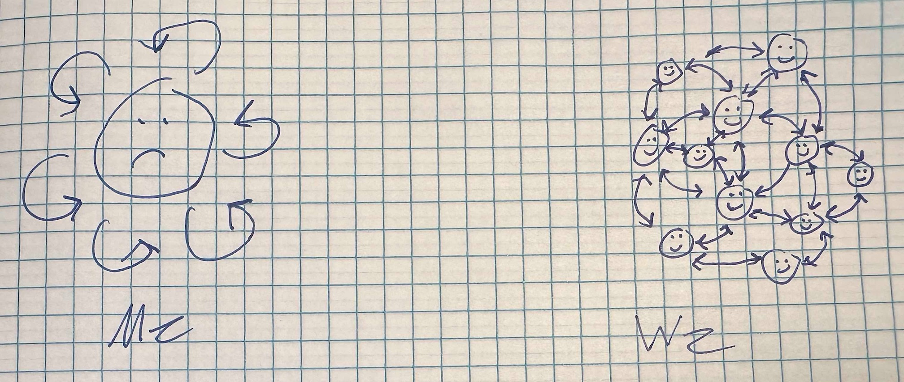

# Haiku

The haiku is a Japanese poetic form that consists of three lines, with five syllables in the first line, seven in the second, and five in the third. The haiku developed from the hokku, the opening three lines of a longer poem known as a tanka.

## Happy Thoughts



```
😵 Instead of just Me
🤘 I'll focus my mind on We
🙂 Then We'll be Happy
```
